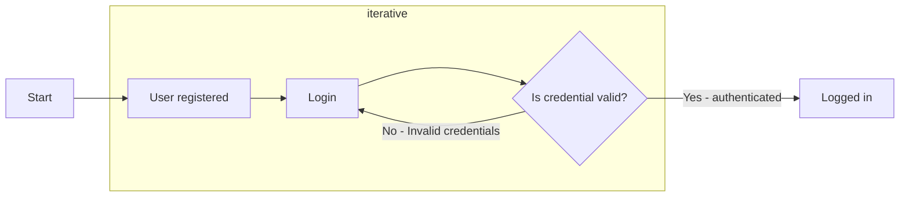

```mermaid
graph LR;
  Start --> A[User registered]
  subgraph iterative
    A --> B[Login]
    B --> C{Is credential valid?}
    C --> |No - Invalid credentials| B
  end
  C --> |Yes - authenticated|D
  D[Logged in]
```