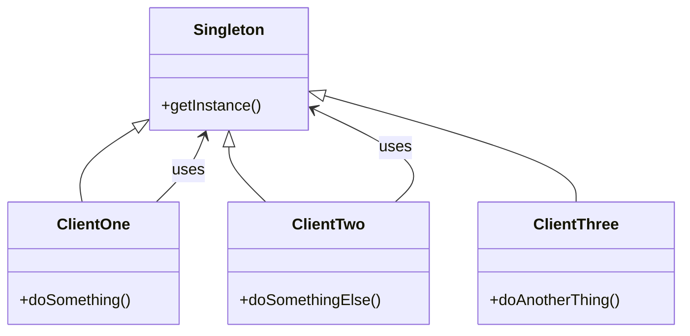
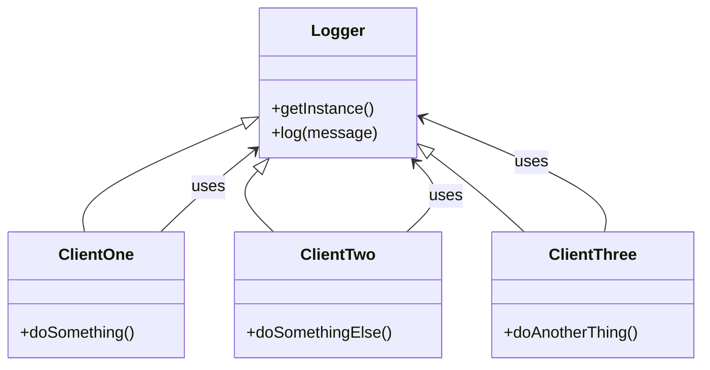

# Singleton Design Pattern

- creational design pattern that ensures that a class has only one instance and provides and only one instance and provides an easy global access to that instance
- the pattern does not stipulate what to do with the Singleton instance, it just ensures that there is only one instance of the class

The main tenets of the Singleton pattern are:

- ensure that the class has only a single instance
- provides easy global access to this instance
- controls how it is instantiated
- any critical region must be entered serially - if there is any kind of thread safety issues - ensure that whatever clients are calling the Singleton they are calling it one at a time - you have to serialize the access

IMPORTANT: The Singleton itself does not stipulate what you do inside the Singleton instance, it just ensures that there is only one instance of the class.

- one Client creates the Singleton instance and then all other Clients use it
- if any other Client tries to create a new instance of the Singleton, it will return the already created instance
- you have to make sure that the Singleton instance is created only once, and that it is thread-safe if you are using it in a multi-threaded environment

## What is the use of the Singleton pattern?

- Logging: you want to have a single instance of a logger that is used throughout the application
- Caching: you want to have a single instance of a cache that is used throughout the application
- Thread pools: you want to have a single instance of a thread pool that is used throughout the application
- Database connections: you want to have a single instance of a database connection that is used throughout the application
- Configuration access: you want to have a single instance of a configuration object that is used throughout the application
- State management: you want to have a single instance of a state manager that is used throughout the application

### Logger Example

## Motivation (Why would we want something like a Singleton?)

- "It is important for some classes to have exactly one instance. Although there can be many printers in a system, there is only one printer spooler. The Singleton pattern ensures that a class has only one instance and provides a global point of access to it."

- The Singleton pattern is often used with the following design patterns:
  - Factory Method: to create the Singleton instance
  - Abstract Factory: to create the Singleton instance
  - Builder: to create the Singleton instance
  - Prototype: to create the Singleton instance
  - Facade: to provide a simplified interface to the Singleton instance
  - State: to manage the state of the Singleton instance
  - Strategy: to provide a different implementation of the Singleton instance
  - Adapter: to adapt the Singleton instance to a different interface
  - Bridge: to bridge the Singleton instance to a different interface

## When do you use the Singleton pattern?

1. when you want to control access to a shared resource
2. when you want to ensure that a class has only one instance
3. when you want to provide a global point of access to a class
4. when you want to provide a single point of control for a class
5. when you want to provide a single point of access to a class

## When NOT to use the Singleton pattern?

1. Use the Singleton pattern with restraint and do not let it denigrate into a global access for everything. Global access hides dependencies and might make it harder to read such code, so make sure you have a good reason to use the Singleton pattern.
2. The main question you should ask is: "Do you violate the SRP(Single Responsibility Principle) by using the Singleton pattern?" If the answer is yes, then you should not use the Singleton pattern. (Just Logging and Caching are good examples of when you can use the Singleton pattern without violating the SRP as they are both single responsibilities but can be developed with the illusion of being a global access point.)

## Design Considerations
1. When design a Singleton, consider Lazy Construction which mean that the class instance should only be created when it is first needed - In some cases we might consider Eager Loading if, for example, we need the singleton to be always ready and loaded fast.
2. Thread Safety needs to be considered in languages that allow multi-threading access to ensure that access is properly controlled and locked, so that the state of the Singleton (if it has one) is always deterministic and consistent.
    -> because Python does support multi-threaded programming, we will need to take special care when creating multi-threaded Singletons = we will need to lock the Critical Section.