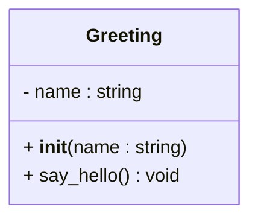
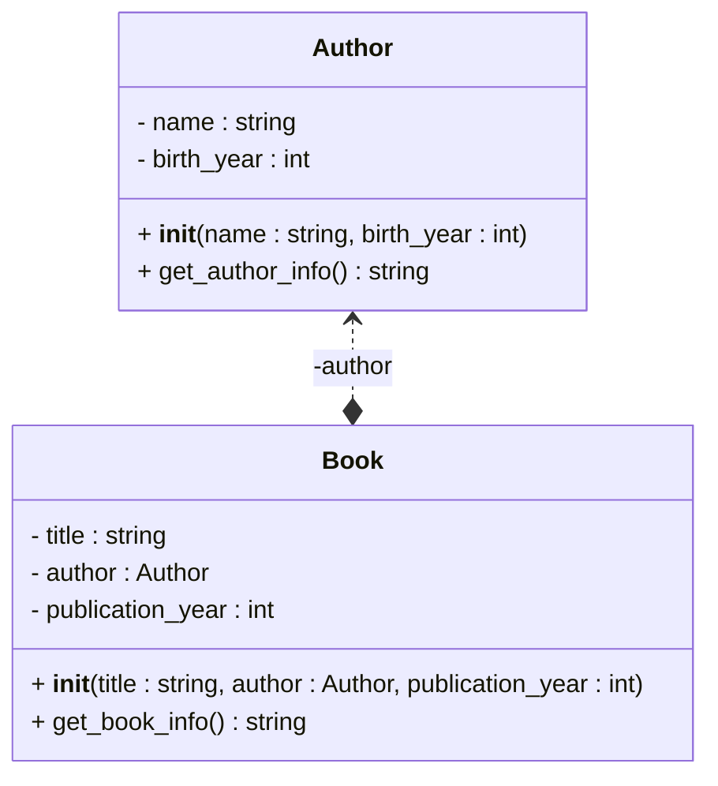
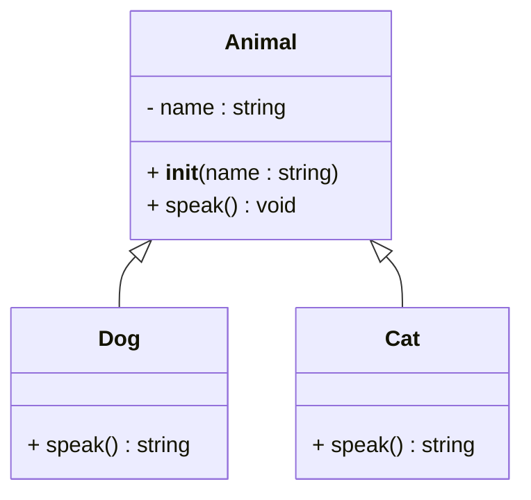
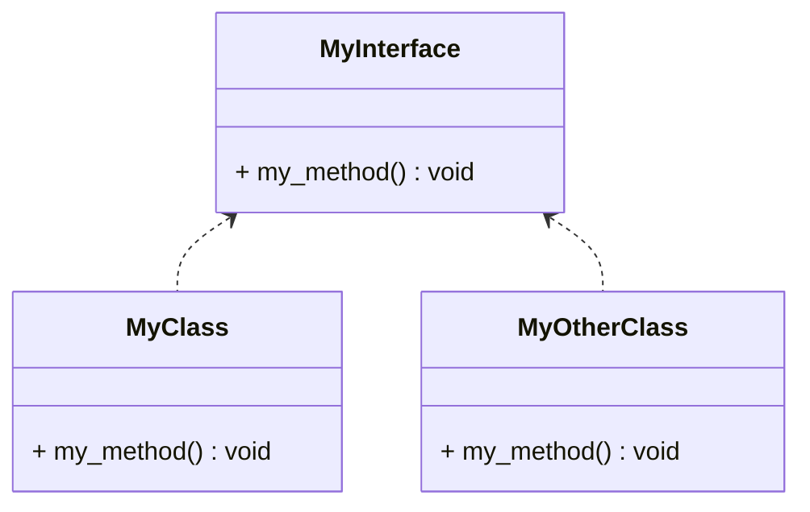
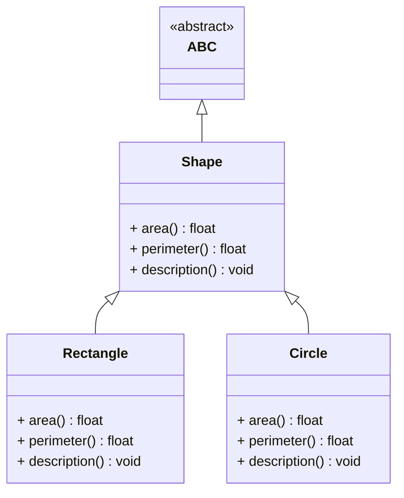

# Object Oriented Programming (OOP)
- revolves around the concept of objects, which encapsulate data (attributes) and behavior (methods and functions)
- common object oriented programming languages include Java, C++, Python, and Ruby
- based on the object-oriented programming paradigm, which is a programming paradigm that uses objects to design applications and computer programs
- based on the object-oriented design (OOD), object-oriented analysis (OOA) and object-oriented modeling (OOM) principles, which are a set of principles that guide the design of object-oriented systems
- based on the SOLID principles, which are a set of principles that help design object-oriented systems that are easy to maintain and extend
- based on the design patterns, which are reusable solutions to common problems in software design

## Greeting Class Example
```python
class Greeting:
    def __init__(self, name):
        self.name = name

    def say_hello(self):
        return f"Hello, {self.name}!"
```




## Encapsulation
```python
class Author:
    def __init__(self, name, birth_year):
        self.name = name
        self.birth_year = birth_year
        
    def get_author_info(self):
        return f"Author: {self.name}, Born: {self.birth_year}"
    
class Book:
    def __init__(self, title, author: Author, publication_year):
        self.title = title
        self.author = author  # This is an instance of Author class
        self.publication_year = publication_year
        
    def get_book_info(self):
        return f"'{self.title}' by {self.author.get_author_info()}, Published: {self.publication_year}"
```



## Inheritance
```python
class Animal:
    def __init__(self, name):
        self.name = name

    def speak(self):
        print(f"{self.name} makes a sound.")    

class Dog(Animal):
    def speak(self):
        return "Woof!"

class Cat(Animal):
    def speak(self):
        return "Meow!"

dog = Dog("Buddy")
cat = Cat("Whiskers")
print(dog.speak())  # Output: Woof!
print(cat.speak())  # Output: Meow!
```



## Inheritance : Interfaces
```python
from abc import ABC, abstractmethod
# Interface Contract - children will have to implement all of the abstract methods - in an interface methods have no implementations so we use 'pass'
class MyInterface(ABC):
    @abstractmethod
    def my_method(self):
        pass
    
class MyClass(MyInterface):
    # because we inherit from MyInterface, we must implement the my_method
    def my_method(self):
        print("Implementation of my_method in MyClass")
        
class MyOtherClass(MyInterface):
    # also must implement the my_method
    def my_method(self):
        print("Implementation of my_method in MyOtherClass")
```



## Asbtractions - Abstract Classes
```python
from abc import ABC, abstractmethod


class Shape(ABC):
    @abstractmethod
    def area(self):
        pass

    @abstractmethod
    def perimeter(self):
        pass

    @abstractmethod
    def description(self):
        print(
            f"This is a shape with area {self.area()} and perimeter {self.perimeter()}"
        )
```

